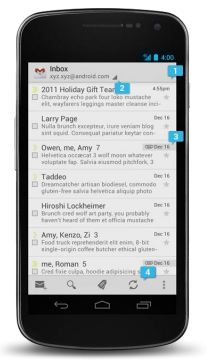

app-design
==========

##设计规范 for Hirebird

基于Android 4+, 参考Gmail for android

设计规范中文文档在res文件夹

###主题

- Holo 浅色底+深色操作栏主题， 扁平化风格，无圆角

###字体

- Roboto , 最小12sp, 最大22sp

###图标

- 以mdpi（32dpx32dp）为基础
- 在移动设备上的启动图标必须是 48x48dp
- 在应用市场上启动图标必须是 512x512dp

###列表
    
- 操作区域以48dp高度为标准, 小场景应用图标16dpx16dp(图标内容14dpx14dp)

###文本

- 描述性文字不超过30个字符

###界面

- 一个典型的 Android app 包含了操作栏和内容区域。

  1. 主操作栏:这是 app 的命令和控制中心。主操作栏包含了导航 app 层级和视图的元素，及最重要操作。
  2. 视图控制:让用户切换 app 提供的不同视图。视图包含了内容不同的组织方式或不同的功能。
  3. 内容区域:内容显示区域。
  4. 次操作栏:次操作栏提供了一种方式，就是把操作从主操作栏，分配放置到次操作栏，它可以在主操作栏的下方或屏幕的底部。这个例子中，次操作栏把没放在主操作栏上的一些功能展示在底部。

    
- 详情间横划（Gmail）切换
    

    
- 同一模块Tab切换.不超过5个
    

- 主菜单

用左侧菜单表现  

###ActionBar(操作栏)

1向上＋ 2 Spinner＋3 重要操作＋ 4 更多操作。
- 所有界面都必须存在
- 左上角的图标，详情页返回列表，首页弹出主菜单 
- 图标32dpx32dp（图标内容24dp+间距）
- CAB(情境操作栏)，根据实际情况显示不同的按钮
- 下拉菜单在频繁切换界面时使用

###导航

- 系统“返回”按钮是返回上一个操作，视图，可返回到其它app入口
- 操作栏的“向上”按钮是返回上一个操作界面，永远停留在当前app中，
    

###通知栏

- 图标24dpx24dp   
- 当你的 app 创建了一个通知而另一个相同类型的通知还在待处理状态时，不要另外再创建一个新通知对象，而是把他们合并显示。
- 通知的预览提供一个简短的文本，可以在通知到来的时候让用户对通知内容有快速、简短的预览。

###手势

触摸，拖动， 横划，双击，长按，放大，缩小

